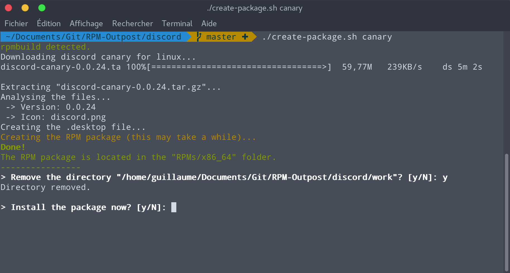

# Discord rpm
Unofficial RPM package for Discord.

## How to use
Open a terminal and run `./create-package.sh stable` to get the stable version of Discord. Replace `stable` by `canary` to get the beta version.

## Features
- Downloads the latest version of Discord from the official website
- Creates a ready-to-use RPM package
- Discord stable and canary can be installed at the same time
- Adds Discord to the applications' list with a nice HD icon
- Tested on Fedora 26 (may work on other distributions)

## More informations

### How to update
When a new version of discord is released, simply run the script again to get the updated version.

### Requirements
The `rpmdevtools` package is required to build RPM packages. The script detects if it isn't installed and offers to install it.

### About root privileges
Building an RPM package with root privileges is dangerous, see http://serverfault.com/questions/10027/why-is-it-bad-to-build-rpms-as-root.

## Screenshot

